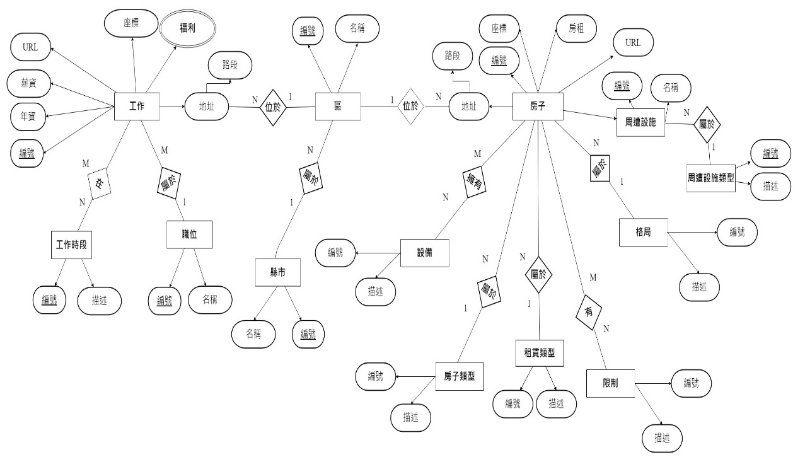
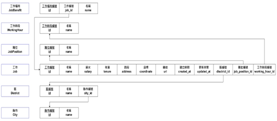
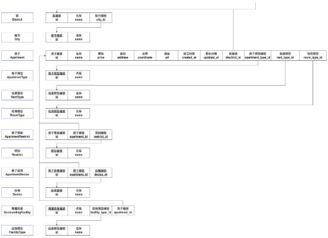

# **111學年第一學期 APP程式設計**

## **期末專案成果報告**

## **職業租屋匹配系統**

### 組員：

C109151104 鄭政文

C109151110 沈育安

C109151163 丁襄龍

C109151162 許哲晟

C109151102 劉官瑜

日期：111年1月12日

## **摘要**

現在剛出社會或者大學新鮮人對於租屋的需求相較於5、6年前已大幅上
升，因此為了節省這類人的找屋時間與提升便利性，現在網路上已有許多租屋網站或者方便找工作的人力銀行，但是這樣的尋找模式依舊很花時間，除了要先找到符合自己的條件的租屋處以外，還要擔心會不會離工作地點與學校，這樣要一直在不同的網站一直來回尋找，十分耗時。

為了解決上述的問題，也出現許多新類型的功能網站，透過自身的工作或者現在居住地來搜尋符合使用者需求的租屋或工作資訊，有效的節省使用者一直在租屋網與人力銀行來回比對與尋找的時間，但是現有的網站仍然有需多缺點，例如：租屋物件涵蓋率可以再增加、搜尋結果雜亂...等，因此為了改善
以上缺點，我們的這次的專題主要方向有兩個：第一、增加資料來源，透過爬蟲取得樂屋網、591租屋網、104人力銀行及1111人力銀行的資料來增加我們的租屋資料多樣性；第二、將搜尋的的結果透過每筆資料中特定的屬性來進行排序，租屋的部分將會採用其附近的設施數量來評分，租屋則是用工作福利來評分排序。

# **目錄**

[目錄](#目錄)

[圖目錄](#圖目錄)

[第一章 前言](#第一章-前言)

[研究動機與研究問題](#研究動機與研究問題)

[背景說明](#背景說明)

[第二章 相關文獻](#第二章-相關文獻)

[豬豬快租](#豬豬快租)

[第三章 研究方法](#第三章-研究方法)

[系統架構](#系統架構)

[爬蟲、後端、前端流程圖](#爬蟲、後端、前端流程圖)

[APP流程圖](#APP流程圖)

[資料庫實體關聯圖](#料庫實體關聯圖)

[關聯資料庫綱目](#關聯資料庫綱目)

[第四章 系統展示](#第四章-系統展示)

[網頁操作流程](#網頁操作流程)

[APP操作流程](#APP操作流程)

[爬蟲展示](#爬蟲展示)

[第五章 結論](#第五章-結論)

[檔案連結](#檔案連結2)

- [1. 爬蟲端](#1.爬蟲端)

- [2. 手機端](#2.手機端)

- [3 網頁前端](#3.網頁前端)

- [4. 後端](#4.後端)

[組員分工](#組員分工)

[參考文獻](#參考文獻)

# **圖目錄**

[圖 1 系統架構圖](#圖-1-系統架構圖)

[圖 2 爬蟲、前端和後端流程圖](#圖-2-爬蟲、前端和後端流程圖)

[圖 3 APP流程圖](#圖-3-APP-流程圖)

[圖 4 資料庫實體關聯圖](#圖-4-資料庫實體關聯圖)

[圖 5 工作關聯資料庫綱目](#圖-5-工作關聯資料庫綱目)

[圖 6 房子關聯資料庫綱目](#圖-6-房子關聯資料庫綱目)

[圖 7 APP操作流程圖](#圖-7-APP操作流程圖)

[圖 8 APP搜尋首頁](#圖-8-APP搜尋首頁)

[圖 9 房子搜尋介面](#圖-9-房子搜尋介面)

[圖 10 房子搜尋結果](#圖-10-房子搜尋結果)

[圖 11 APP資訊選單](#圖-11-APP資訊選單)

[圖 12 烏龜養成介面](#圖-12-烏龜養成介面)

[圖 13 烏龜介面操作結果](#圖-13-烏龜介面操作結果3)

[圖 14 591租屋網爬蟲部分程式碼](#圖-14-591租屋網爬蟲部分程式碼)

[圖 15 1111人力銀行爬蟲部分程式碼](#圖-15-1111人力銀行爬蟲部分程式碼)

# **第一章 前言**

## **研究動機與研究問題**

此 app 是希望幫助人們在選擇工作或住屋時，能夠考慮到距離的因素。很多人在選擇工作或住屋時，會考慮到距離是否方便，因此我們的 app 可以提供一個平台，讓人們能夠根據自己的工作或住屋位址，搜尋附近的工作或住屋選擇。目的方面，這樣的 app 可能希望幫助人們更快捷、更方便地找到適合自己的工作或住屋，並且讓人們能夠更好地規劃自己的生活，使得工作和居住能夠更加配合。

## **背景說明**

在台灣，許多人都需要租房子和找工作。由於台灣的房價相對較高，許多人可能會選擇租房子而不是購買。根據統計，台灣的租屋人口約有300萬人。尋找合適的住房可能會是一項挑戰，因為房屋市場可能非常競爭。您可能需要花費較多時間找尋合適的房屋，並且需要考慮許多因素，例如租金、房屋位置
、房屋大小和設施等。在台灣尋找工作也可能是一項挑戰。根據統計，台灣的就業人口約有1,141萬人。這意味著有許多人都在尋找工作，競爭也可能比較激烈。您可能需要花費較多時間尋找合適的工作，並且需要考慮許多因素，例如工作內容、工作地點、薪資和福利等。

# **第二章 相關文獻**

## **豬豬快租**

`	`豬豬快租APP的租屋系統是一個便利而實用的工具，可以幫助用戶快速、輕鬆地找到適合的租屋選項。

`	`首先，用戶可以使用豬豬快租APP的搜索功能，根據地區、房間數量、租金範圍等條件進行檢索。搜索結果會顯示所有符合條件的房源信息，包括地址、房間數量、租金、以及房屋的照片等。用戶可以通過查看房屋照片，此外還有更細節的過濾功能，例如：附近超市、學校、公交站等，或是用戶需要的配備，例如：空調、洗衣機等。可以讓用戶輕鬆的找到滿足自己需求的房源，快速了解房屋的狀況。

`	`其次，豬豬快租APP的租屋系統還提供了地圖功能。用戶可以在地圖上查看房源的位置，並根據自己的需求選擇符合條件的房源，還支持在線租房，用戶可以直接在APP上選擇房源並與房東聯繫，簽署租約並繳納押金。這樣可以使租房過程更加便捷，也減少了紙質文件的流通。

`	`總結來說, 豬豬快租APP的租屋系統是一個非常方便的工具，可以幫助用戶在短時間內找到合適的租屋選項。 通過提供詳細的房源信息、地圖功能和細節的過濾功能，豬豬快租APP的租屋系統可以節省用戶搜索房源的時間和精力，讓用戶能夠輕鬆地找到適合的租屋選項。

**優點:**

1.提供更人性化的搜尋流程

2.一次找到各大租屋網站資訊

3.過濾重複物件，非常方便省時

4.強大的搜尋/過濾條件設定

5.在線租房：用戶可以直接在APP上選擇房源並與房東聯繫，簽署租約並繳納押金。

**缺點:**

1.UI 呈現比較單調

2.租屋物件涵蓋率可以再增加

3.增加即時通知可以大大增加實用性

# **第三章 研究方法**

## **系統架構**

如圖1所示，由後端API連結爬蟲、資料庫和客戶端，下一頁有更詳細說明。

#### 圖 1 系統架構圖

## **爬蟲、後端、前端流程圖**

詳細流程如圖2所示。

#### 圖 2 爬蟲、前端和後端流程圖

## **APP流程圖**

`	`如圖3 所示，共有四個頁面(綠框)，包含公告頁面、搜尋頁面、其他頁面、寵物頁面，其中前三項頁面在進入APP後即可在底部導覽列做更換，而進入寵物頁面需點選位於其他頁面的pet按鈕；而籃框為該頁所包含的功能詳細操作於13頁。

#### 圖 3 APP流程圖

## **資料庫實體關聯圖**

#### 圖 4 資料庫實體關聯圖

## **關聯資料庫綱目**

### **工作**

#### 圖 5 工作關聯資料庫綱目

### **房子**

#### 圖 6 房子關聯資料庫綱目

# **第四章 系統展示**

## **網頁操作流程**

第一步 
項目(1) 利用工作地點找房子(左邊)

利用房子點地找工作(右邊) 

第二步 (EX:使用工作地點找房子)
項目(2) 填寫目前工作地址、選擇搜尋地區

第三步

項目(3) 填寫租金、租賃類型、房子類型、格局、設備、限制條件
(依照使用者條件選擇)

第四步

設定完條件後，點擊搜尋將利用使用者條件顯示相對應的房屋

## **APP操作流程**

#### 圖 7 APP操作流程圖

搜尋功能操作詳細步驟如下 (以工作地點找房屋為舉例)

第一步

先選擇下方的Search 圖示並選擇上方功能，如圖8所示。

利用工作地點找房子(綠色箭頭)

利用房子點地找工作(橙色箭頭)

#### 圖 8 APP搜尋首頁

第二步 

Ex：使用工作地點找房子功能，如圖9所示。

輸入目前工作的地址(紅色箭頭)

選擇欲租屋縣市/區域(綠色箭頭)

輸入理想的租金範圍(藍色箭頭)

選擇房屋類型 (可選可不選)

#### 圖 9 房子搜尋介面

`	`第三步

點擊 搜尋/Search
將會顯示出符合使用者條件的住屋，如圖10所示。

#### 圖 10 房子搜尋結果

寵物頁面操作如下:

第一步

點擊pet

#### 圖 11 APP資訊選單

第二步

點擊餵食或陪伴

點擊餵食+1飽足感，滿格後龜龜會變大

點擊陪伴+1幸福感，幸福感會隨時間減少

#### 圖 12 烏龜養成介面

#### 圖 13 烏龜介面操作結果

變大後的龜龜和感到幸福的龜龜

## **爬蟲展示**

我們的爬蟲主要是透過 selenium 套件進行動態網站的讀取，因為selenium套件所提供的查找element方法都需要一直與該網頁進行連線，因此我們會需要用到BeautifulSoup這個套件來先儲存網頁的element，這樣需要用到的時候就可以直接利用Beautiful的方法來查找資料，以下圖14為591租屋爬取租屋資料的程式碼與圖15爬取1111人力銀行資料的程式碼。

#### 圖 14 591租屋網爬蟲部分程式碼

#### 圖 15 1111人力銀行爬蟲部分程式碼

# **第五章 結論**

對於這次的專題實作結果，我們還是感到相當滿意，前端除了網頁還有APP可供使用者使用，我們對於前端UI/UX的設計也是有在注意，讓使用者實際操作起來方便上手，且提供給使用者的資訊是透過附近公共設施當作權重所排列出的最佳選擇；在根據製作的時間以及資源來看，我們已經將這些時間與資源發揮到極致了，或許還有些地方美中不足，可以再做改進，但是這些問題都是在未來可以再持續修正；我們在這次的專題實作中涉獵到很多實用的知識，比如，如何帶領一個團隊、一個團隊如何進行溝通、彼此間如何相互配合與鼓勵；此外對於時間的管控、程式版本控制也經由此專題實作讓我們學到了一課；另外撰寫程式的能力，如網頁開發、資料庫運用、爬蟲程式撰寫以及跨平台APP的設計，這些技術與學問是在很多課堂中都學不到的硬實力，讓我們可以在短短一個學期，初探一個相對有規模的計畫製作過程，而不只是在IDE上印出「Hello World!」這種單薄的程式能力，而是全方面技術「質」的提升，感謝教授這學期的教導，感謝給我們這種機會來學習到更多的知識。

# **檔案連結**

**1. 爬蟲端**

連結：<https://github.com/Kevin-Shen-and-Cipher/live-in-crawler.git>

**2. 手機端**

連結：<https://github.com/Kevin-Shen-and-Cipher/live-in-mobile-app.git>

**3. 網頁前端**

連結：<https://github.com/Kevin-Shen-and-Cipher/live-in-frontend.git>

**4. 後端**

連結：<https://github.com/Kevin-Shen-and-Cipher/live-in-backend.git>

# **組員分工**

|**組員**|**負責工作**|
| :-: | :-: |
|
鄭政文

|
1. 網頁前端

2. 後端API

3. 系統架構設計

4. 資料表設計

5. PPT製作

6. Word製作
|
|
沈育安

|
1. 爬蟲端

2. Word製作
|
|
丁襄龍

|
1. 手機端

2. PPT製作

3. Word製作
|
|
許哲晟(aka龜狗)

|1. 手機端|
|
劉官瑜

|
1. 爬蟲端(輔助)

2. PPT製作

3. Word製作

4. 製圖
|

**參考文獻**

1.爬蟲資料來源

\- 104 ( <https://www.104.com.tw/jobs/main/> )

\- 1111人力銀行 ( <https://www.1111.com.tw/> )

\- 591 房屋交易網 ( <https://www.591.com.tw/> )

\-樂屋網 ( <https://www.rakuya.com.tw/> )

2.相關研究

豬豬快租

